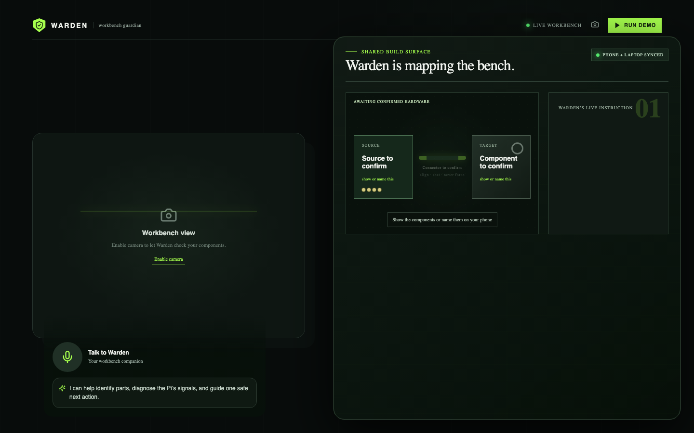

# Warden

**An agentic hardware debugger for the physical world.**

Warden is a camera-aware voice agent for building, inspecting, and debugging real hardware. A learner uses their phone as Warden’s eyes and voice; a laptop becomes a synchronized build surface that renders the next connection and verification step. It is built for robotics, electronics, and hands-on engineering—not as another chat window.

> “I’m Warden, your agentic hardware debugger. What are we building, fixing, or figuring out today?”



_The laptop companion stays intentionally sparse: camera context on the left, and the current source → connector → target action on the right._

## The product loop

1. **See** — Warden inspects opt-in browser camera frames for components, labels, pin names, addresses, screen values, and printed codes.
2. **Reason** — it makes a calibrated identification, asks for confirmation when evidence is partial, and proposes one safe next action.
3. **Show** — the laptop companion turns the current turn into a source → connector → target architecture and concise action steps.
4. **Verify** — the Pi bridge reports real or simulated hardware state. Warden calls a connection verified only when evidence supports it.

## Run it

From this directory:

```bash
npm install
npm run dev
```

In a second terminal:

```bash
cd bridge
python3 -m venv .venv
source .venv/bin/activate
pip install -r requirements.txt
uvicorn main:app --host 127.0.0.1 --port 8787
```

Open `http://127.0.0.1:5173` on a laptop. For a phone demo, expose the Vite server with an HTTPS tunnel and open its public URL on the phone.

1. Tap **Talk to Warden** and allow microphone access.
2. Say: “I’m building with my Raspberry Pi. I want to show you what I have.”
3. Open the camera when Warden asks and show the workbench.
4. Keep the laptop open: the shared build surface updates from the same voice turn with the current action and verification signal.

Use **Run demo** for a deterministic Pi/Qwiic walkthrough with no physical hardware.

## What is real vs. simulated

| Capability                                      | Live mode                                     | Mock mode                           |
| ----------------------------------------------- | --------------------------------------------- | ----------------------------------- |
| Phone microphone and ElevenLabs agent           | Real                                          | Real                                |
| Browser camera and camera-frame analysis        | Real, opt-in                                  | Real, opt-in                        |
| Reading legible labels/codes                    | Model-assisted                                | Model-assisted                      |
| Laptop build architecture                       | Generated from current voice + vision context | Same flow                           |
| Pi bridge / I²C values                          | Connected Pi adapter when configured          | Deterministic simulated state       |
| APDS9960 / button / encoder / PiTFT walkthrough | Hardware-dependent                            | One-click deterministic walkthrough |

Warden never represents mock I²C state as a physical observation.

## How AI is used

Warden uses AI to turn a physical, spoken problem into a cautious next action—not to pretend it can see or verify everything.

- **ElevenLabs Conversational AI** provides the low-latency, interrupt-resistant voice conversation. The browser receives a short-lived session URL; the API key stays on the bridge.
- **Vision + OCR reasoning** uses Claude when configured. User-approved camera frames are inspected for visible components, labels, pin names, I²C addresses, screen values, and printed codes. Warden states a likely identification and asks for confirmation when the view is partial; it never invents unreadable text or claims an electrical connection from an image alone.
- **OpenAI Astra** is the preferred coaching provider for text and optional image-aware reasoning. **OpenRouter** is a live OpenAI-compatible fallback path, allowing the team to choose a suitable model without changing the client. Claude remains a secondary vision-capable provider, followed by a deterministic local-safe fallback.
- **Exa** powers the bridge’s optional `/research` capability for source discovery: datasheets, pinouts, manuals, and component documentation. It is deliberately separate from the fast voice loop, so retrieval never blocks an immediate physical instruction.
- **Structured planning** converts the current spoken response and visual observation into a compact JSON plan—source, connector, target, up to three action steps, and one verification signal—which drives the laptop companion.

### AI-assisted development

OpenAI Codex was used as an engineering copilot to implement and iterate on the product: the React/TypeScript interface, FastAPI bridge, provider routing, safety constraints, camera/voice handoffs, documentation, and test/build checks. It did not replace product judgment: the safety policy, demo flow, and claims about real versus simulated hardware are explicit in the codebase.

## Configuration

```bash
cp bridge/.env.example bridge/.env
```

Required for live voice:

```bash
ELEVENLABS_API_KEY=
ELEVENLABS_AGENT_ID=
```

Recommended for camera understanding and laptop-plan generation:

```bash
ANTHROPIC_API_KEY=
ANTHROPIC_MODEL=claude-sonnet-4-6
```

Optional primary reasoning provider:

```bash
OPENAI_API_KEY=
```

Optional provider routing and documentation research:

```bash
OPENROUTER_API_KEY=
OPENROUTER_MODEL=openai/gpt-4.1-mini
EXA_API_KEY=
```

Routing order for `/coach` is OpenAI Astra → OpenRouter → Anthropic → local safe fallback. The Exa endpoint is available at `POST /research` and returns a small, source-oriented result set only when `EXA_API_KEY` is configured.

`bridge/.env` is ignored by Git. Never commit, screenshot, or paste credentials into source files.

## Safety

Warden supports low-voltage learning and workbench tasks. It does **not** instruct mains power, live high-voltage systems, hazardous chemicals, gas, high-current battery packs, or other tasks that need a qualified professional. Visual uncertainty is stated plainly; Warden does not fabricate component IDs, codes, wiring, or verification.

## Documentation

- [Architecture](docs/ARCHITECTURE.md)
- [90-second demo script](docs/DEMO.md)

## Before presenting

```bash
npm run build
curl http://127.0.0.1:8787/health
```

Refresh the laptop and phone pages, start a fresh voice session, and ensure the laptop companion is neutral before the first camera confirmation.
